## 系统管理
### 用户管理
- 提供基本的用户增删改查
  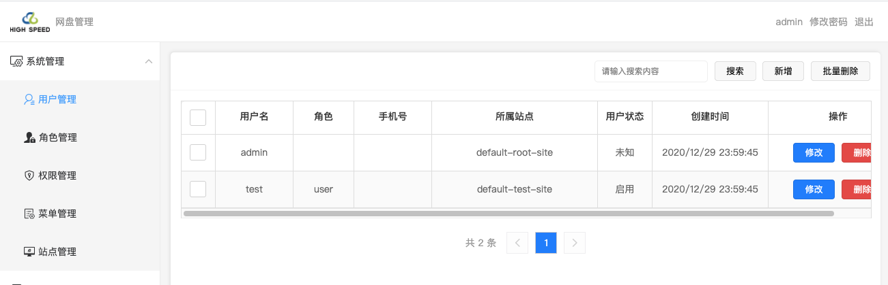
- 用户编辑
  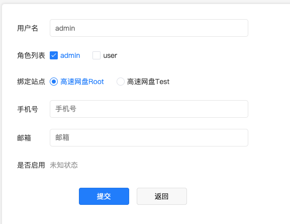

### 角色管理
- 提供基本的角色增删改查
  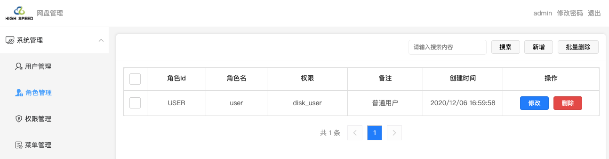
- 角色编辑
  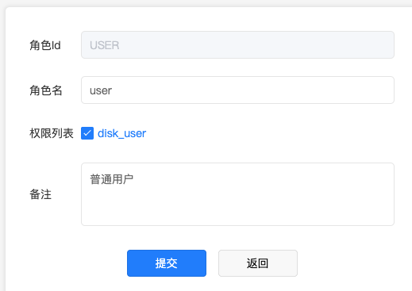

### 权限管理
- 提供基本的权限增删改查
  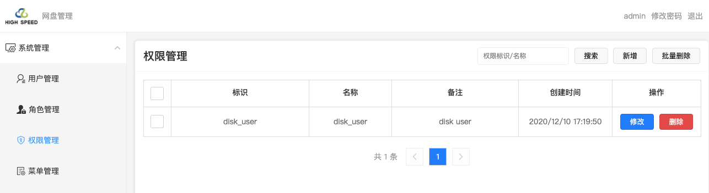
- 权限编辑
  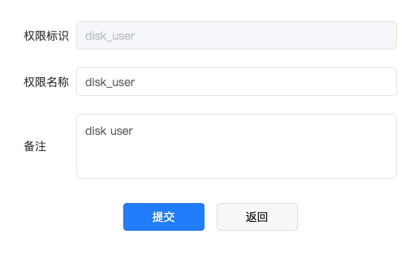

### 菜单管理
- 提供基本的菜单增删改查
  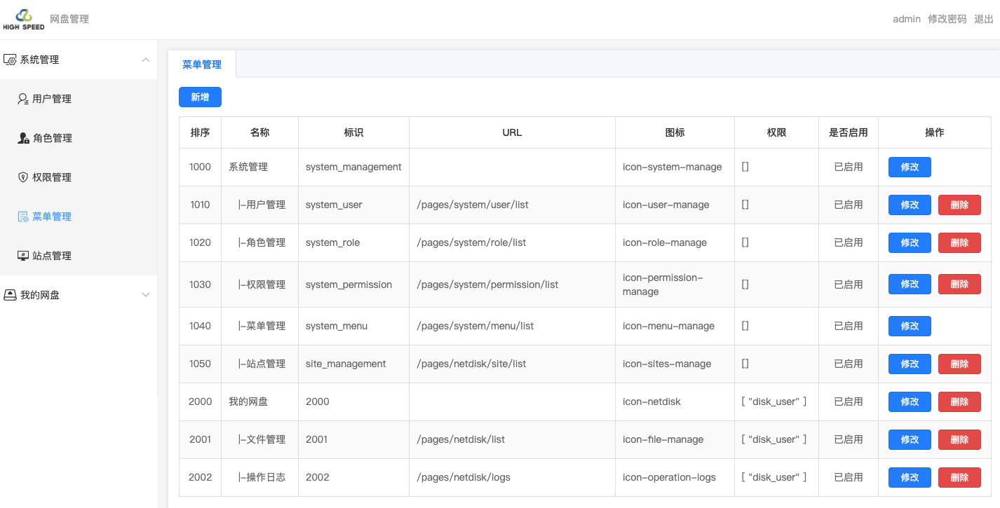
- 菜单编辑
  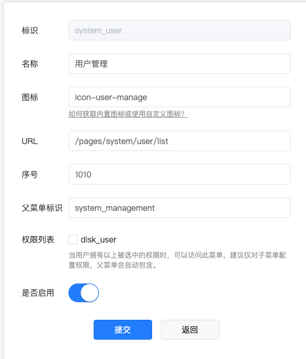

### 站点管理
- 提供基本的站点增删改查
  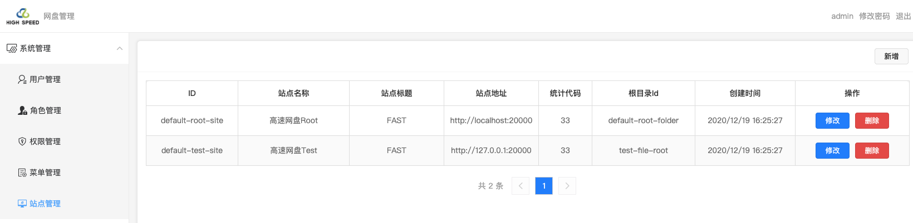
- 站点编辑
  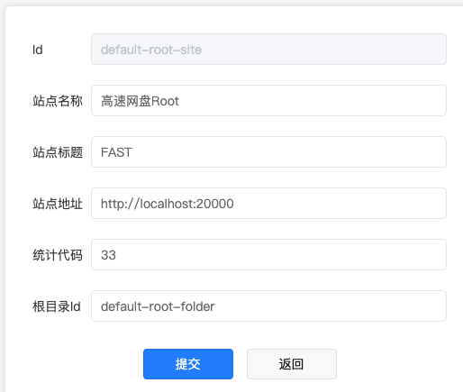
- `根目录ID`来源 (打开uniCloud Web控制台，选择`freecloud-admin`服务空间，进入【云数据库】-> 【opendb-netdisk-files】选择合适记录的`_id`字段)
  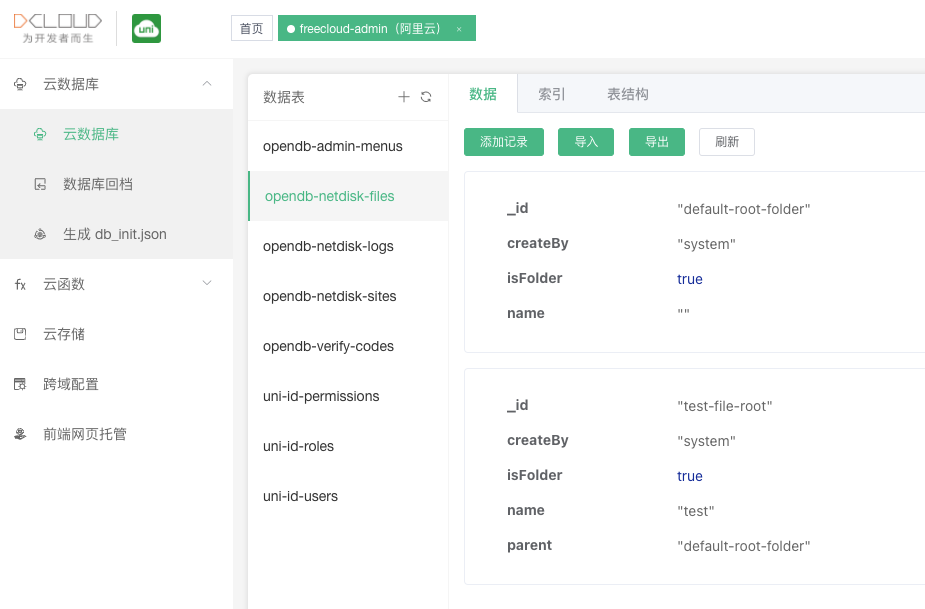
  
## 网盘文件管理
### 新建文件夹
- 点击左上角【新建文件夹】按钮，能够在任意位置创建文件夹
  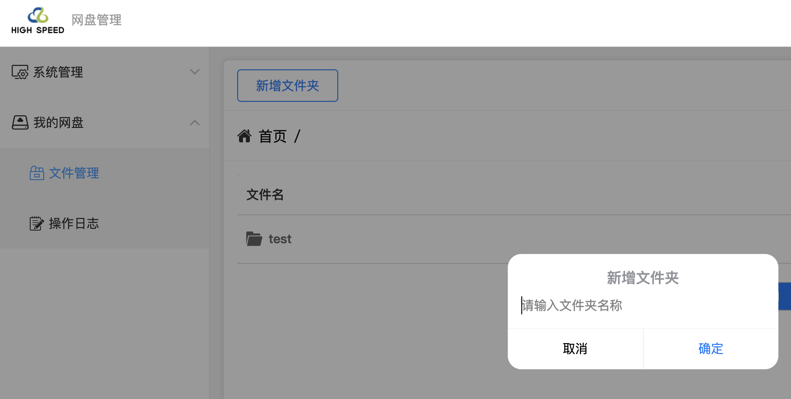
### 上传文件
- 点击右上角【上传文件】按钮，可多选文件
  
  !> 由于平台限制，单个文件不能超过100M

  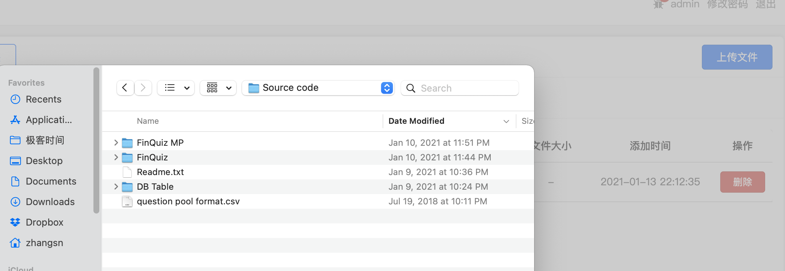
### 重命名文件/文件夹
- 右键点击文件/文件夹，选择【重命名】
  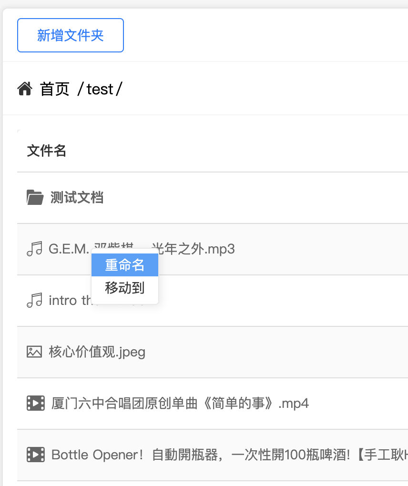
- 文件/文件夹名称进入可编辑状态
  
### 移动文件/文件夹
- 右键点击文件/文件夹，选择【移动到】
  
- 在弹出框中选择目标位置
  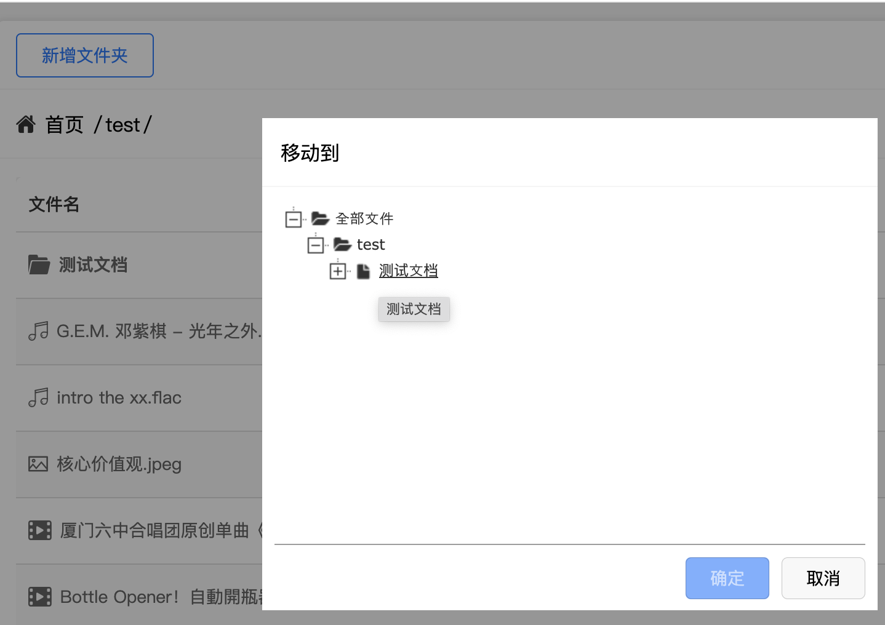

## 在线预览
### word系列
  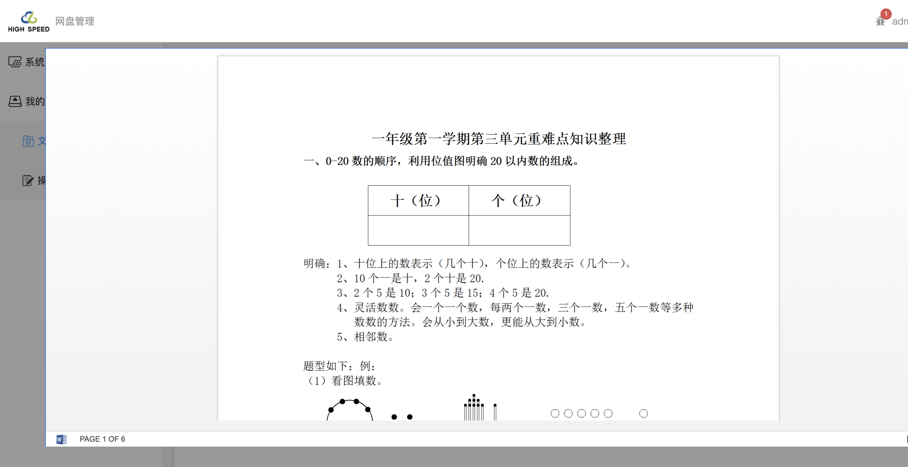
### excel系列  
  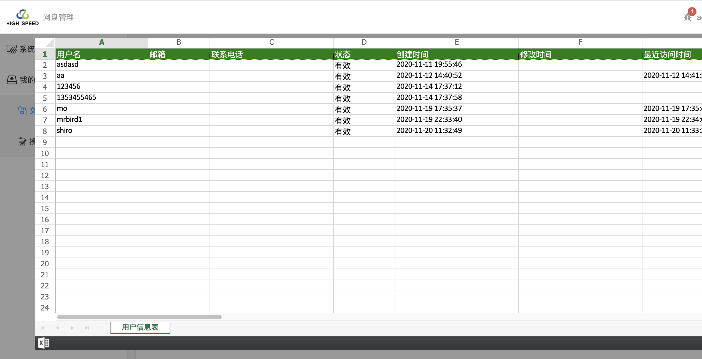
### powerpoint系列  
  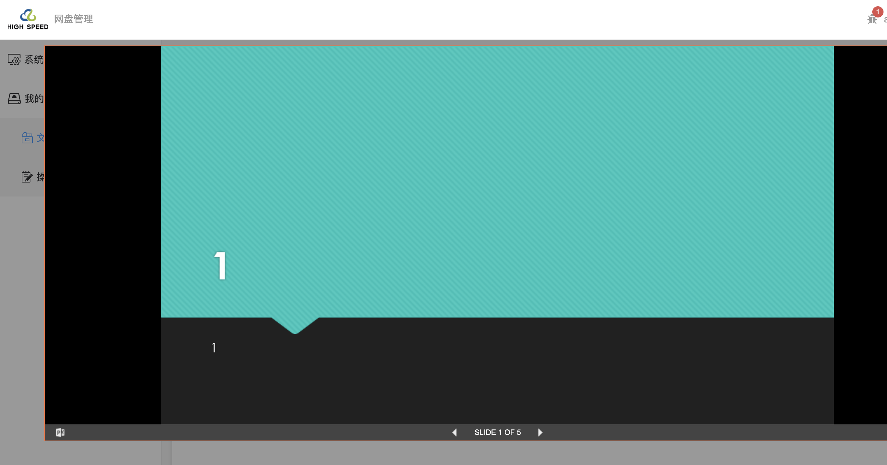
### 视频
  
### 音乐
  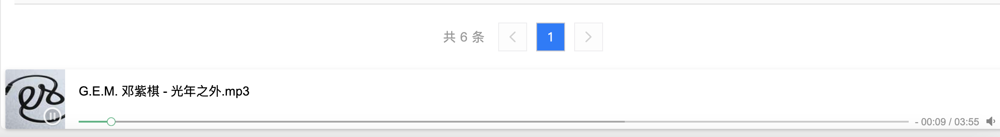
### 图片
  
