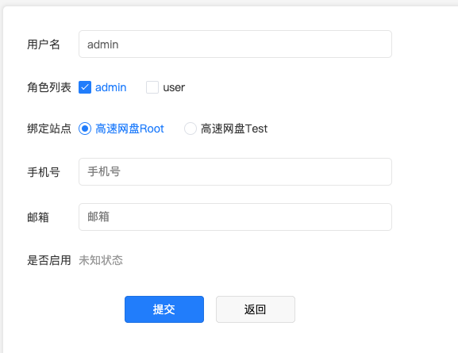
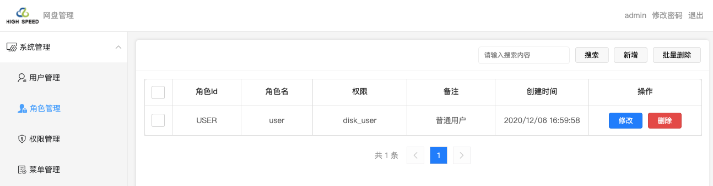
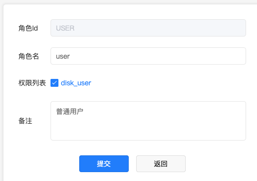
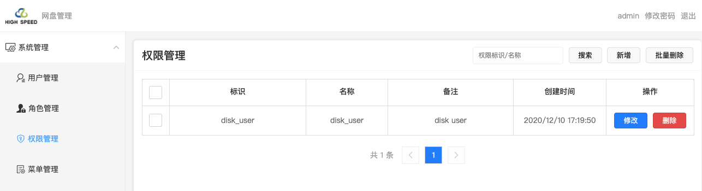
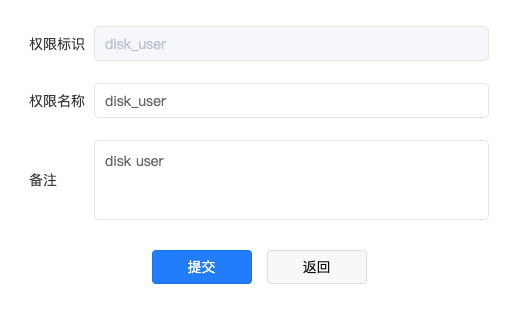
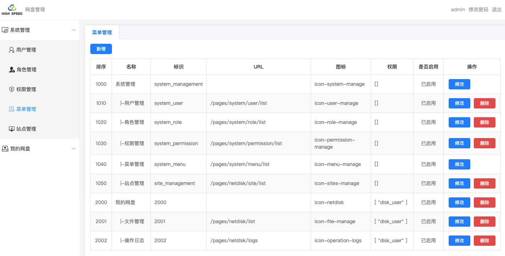
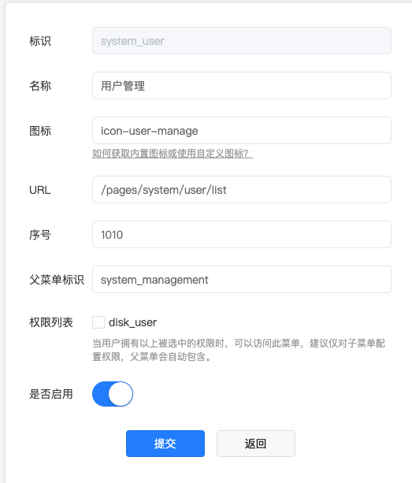
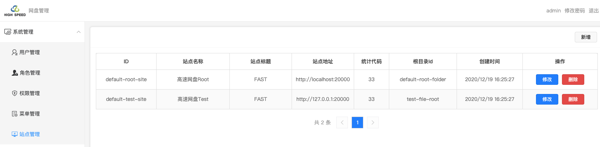
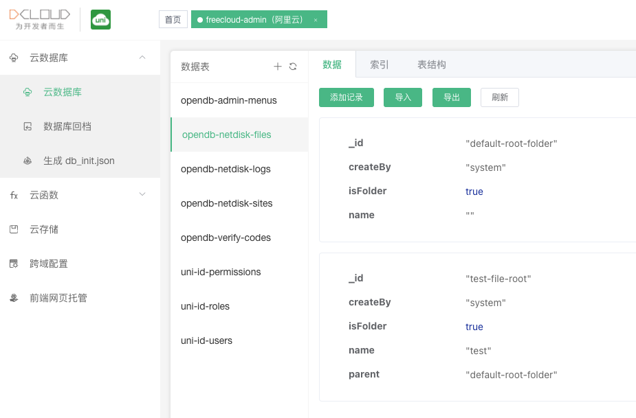

## 系统管理
### 用户管理
- 提供基本的用户增删改查
  
- 用户编辑
  

### 角色管理
- 提供基本的角色增删改查
  
- 角色编辑
  

### 权限管理
- 提供基本的权限增删改查
  
- 权限编辑
  

### 菜单管理
- 提供基本的菜单增删改查
  
- 菜单编辑
  

### 站点管理
- 提供基本的站点增删改查
  
- 站点编辑
  
- 根目录ID来源 (打开uniCloud Web控制台，选择【freecloud-admin】服务空间，进入【云数据库】-> 【opendb-netdisk-files】选择合适记录的_id字段)
  

## 网盘管理

