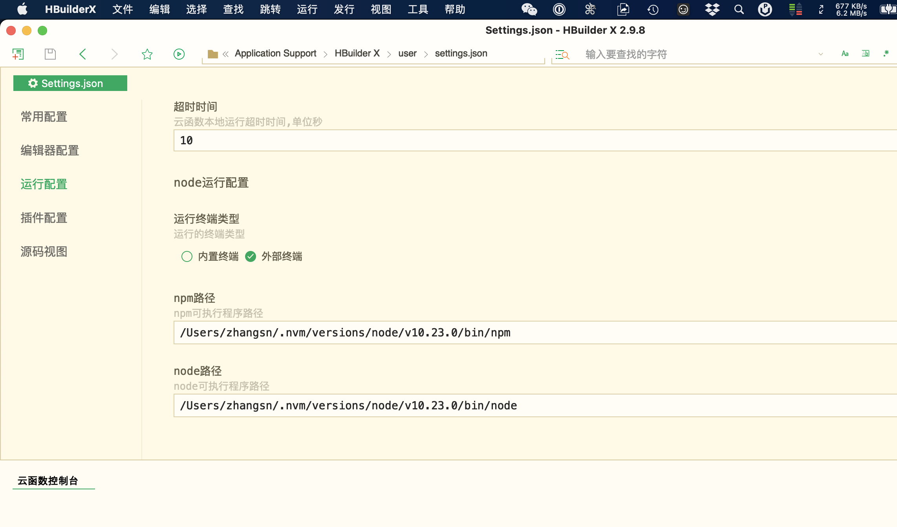

## 软件安装及环境配置
- 截止目前(2020-12-28)，`HBuilderX` 官网最新的正式版为`v2.9.8`，MacOS版下载地址为 https://download1.dcloud.net.cn/download/HBuilderX.2.9.8.20201119.full.dmg ， 其他平台的及版本请去官网 https://www.dcloud.io/hbuilderx.html 下载
- 强烈推荐使用 [nvm](https://github.com/nvm-sh/nvm) 管理本地的NodeJs版本

  !> NodeJs版本需高于 `10.x`，不然`eslint`会报错

- 安装完成后，使用命令`which npm`及`which node`获取npm和node的真实路径如下
    ```
    /Users/zhangsn/.nvm/versions/node/v10.23.0/bin/node
    ```
- 打开 `HBuilderX`，依次展开【偏好设置】-> 【运行配置】-> 【npm路径】及【node路径】，将上一步获得的路径填入其中
  
## 检出代码
