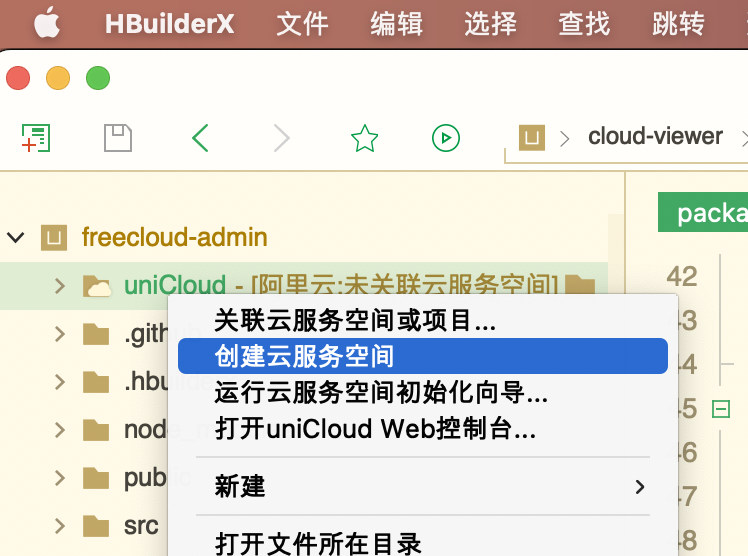
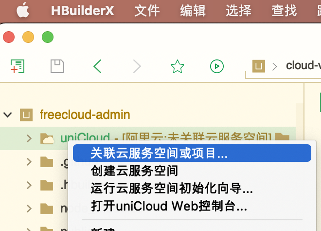
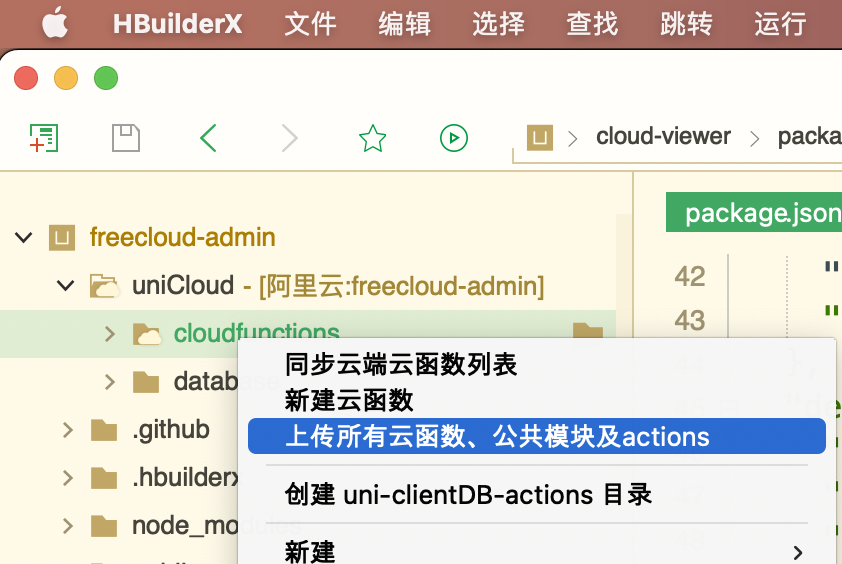
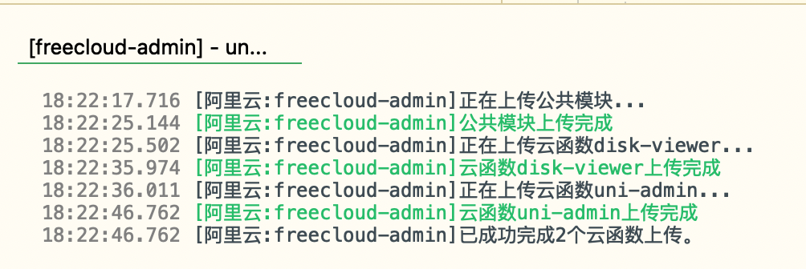
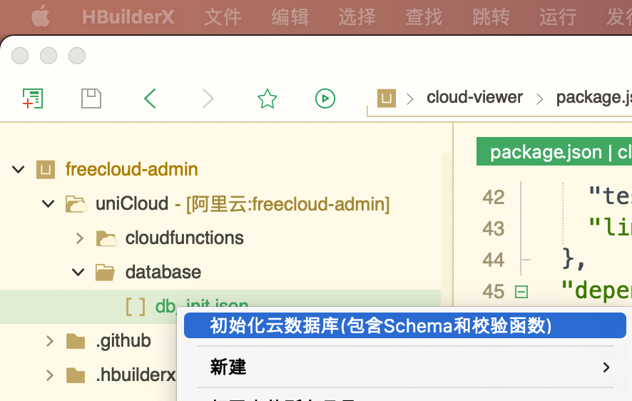
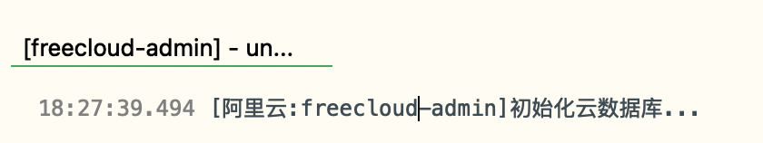
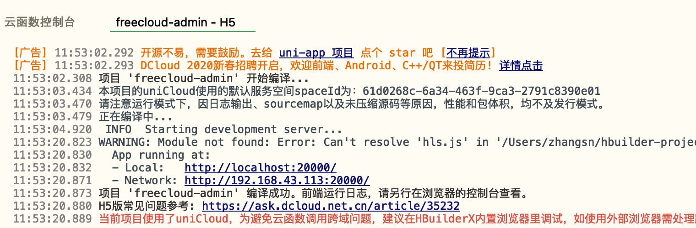

### 软件安装及环境配置
- 截止目前(2021-01-10)，`HBuilderX` 官网最新的正式版为`v3.0.5`，MacOS版下载地址为 https://download1.dcloud.net.cn/download/HBuilderX.3.0.5.20210107.full.dmg ， 其他平台的及版本请去官网 https://www.dcloud.io/hbuilderx.html 下载
- 强烈推荐使用 [nvm](https://github.com/nvm-sh/nvm) 管理本地的NodeJs版本

  !> NodeJs版本需高于 `10.x`，不然`eslint`会报错

- 安装完成后，使用命令`which npm`及`which node`获取npm和node的真实路径如下
    ```
    /Users/zhangsn/.nvm/versions/node/v10.23.0/bin/node
    ```
- 打开 `HBuilderX`，依次展开【偏好设置】->【运行配置】->【npm路径】及【node路径】，将上一步获得的路径填入其中
  

### 导入项目
- 检出代码
  ```bash
  git clone https://github.com/git9527/freecloud-admin
  ```
- 进入项目文件夹并安装依赖
  ```bash
  cd freecloud-admin
  npm install
  ```
- 打开`HbuilderX`并导入本地项目
  
### 设置云空间
- 在云函数目录`uniCloud`右键菜单【创建云服务空间】
  
- 在浏览器自动弹出的web控制台 https://unicloud.dcloud.net.cn 中，选择【阿里云】作为服务商，输入`freecloud-admin`确认创建  
  
  !> 如果未进行实名认证，会跳转至实名认证页面进行实名认证，等待实名认证审核之后可以开通服务空间
  
  
- 在web控制台中进入刚创建的云空间，添加新的安全域名`localhost:20000`
  
- 回到`HBuilderX`在云函数目录`uniCloud`右键选择【关联云服务空间】，再选择刚创建的【freecloud-admin】
  
- 展开`uniCloud`文件夹，在`cloudfunctions`文件夹上右键选择【上传所有云函数、公共模块及actions】
  
  - 点击【确认】替换已存在的公共模块  
  
  - 控制台会输出上传结果
  
- 展开`uniCloud`文件夹，在`database`文件夹内的`db_init.json`上右键选择【初始化云数据库(包含Schema和校验函数)】
  
  - 控制台会输出上传结果(可能是Bug，未显示成功)
  
### 本地运行
- 从`HbuilderX`顶部工具栏选择【运行至浏览器】->【Chrome】(其他浏览器也行)
  
  
  
- 在打开的浏览器中输入用户名/密码
  - 初始超级管理员`admin`/`admin123`
  - 初始子站点管理员`test`/`test123`
  

  
