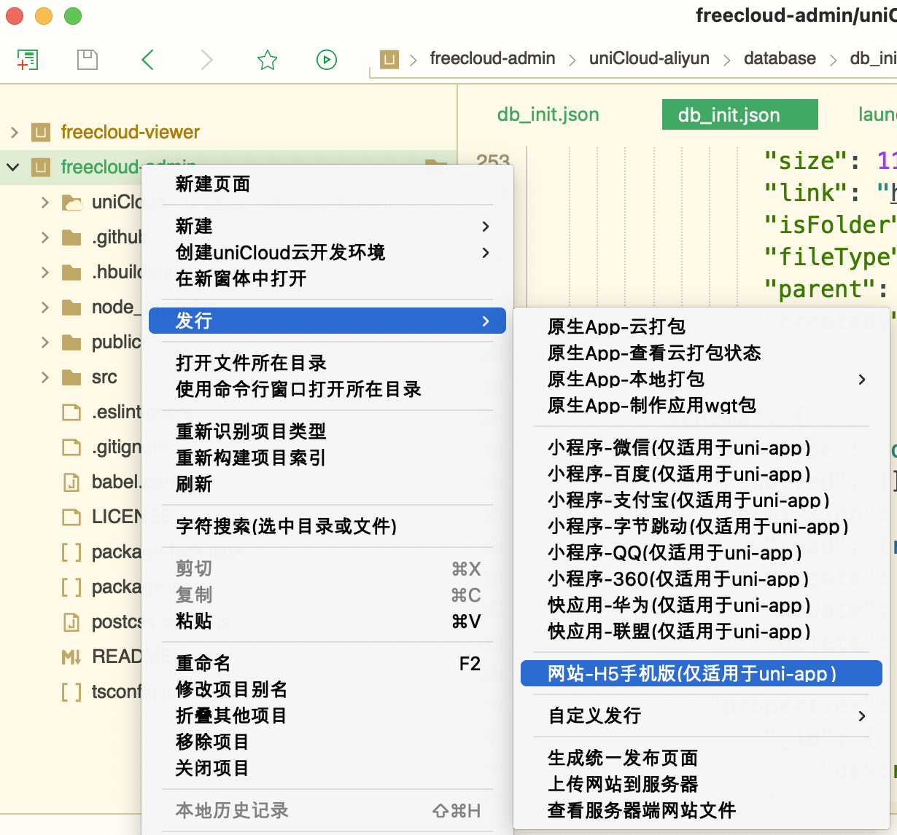
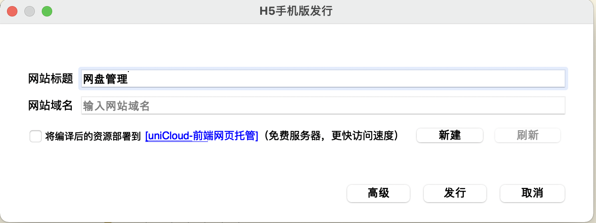
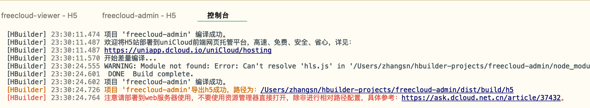
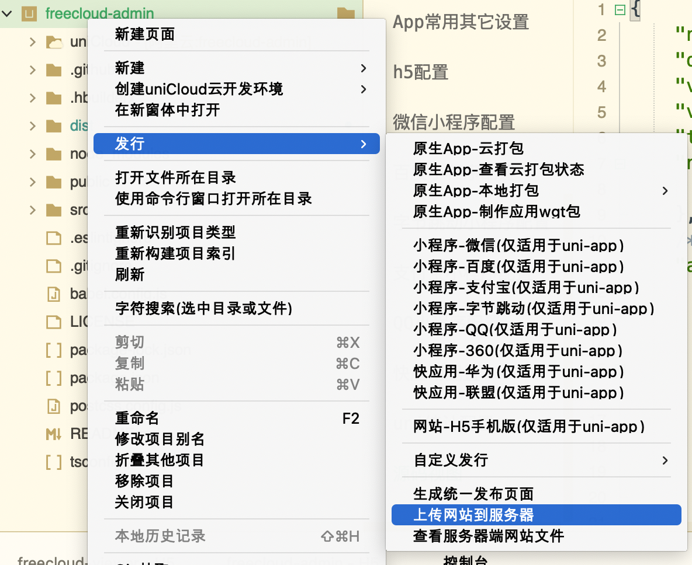
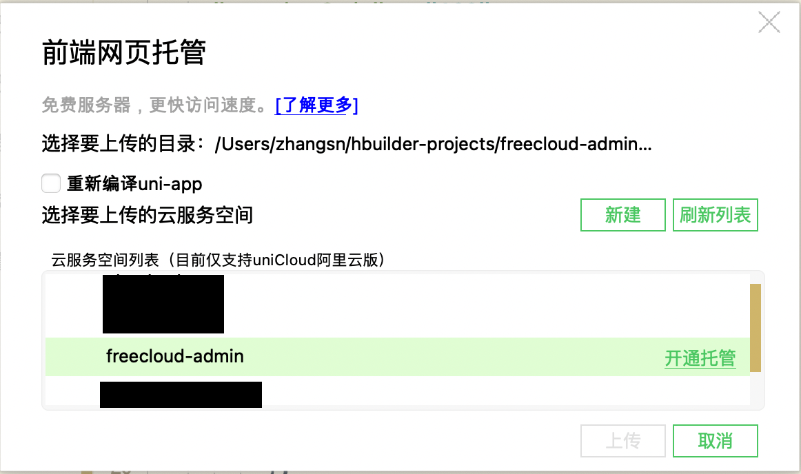
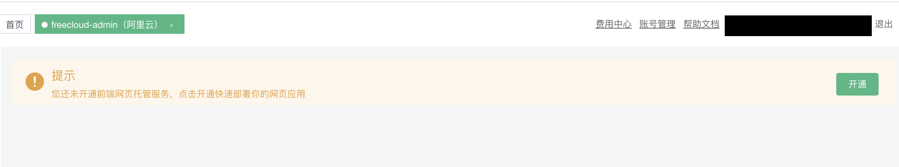
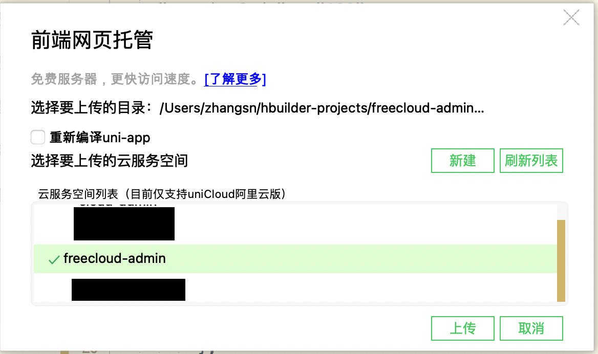
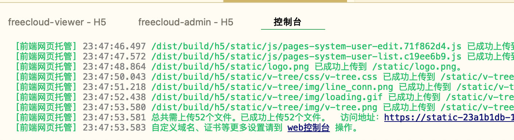
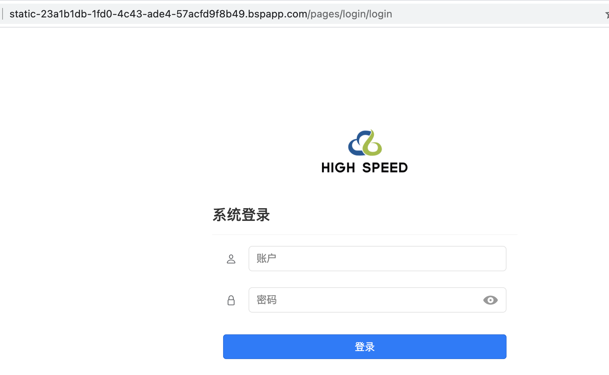
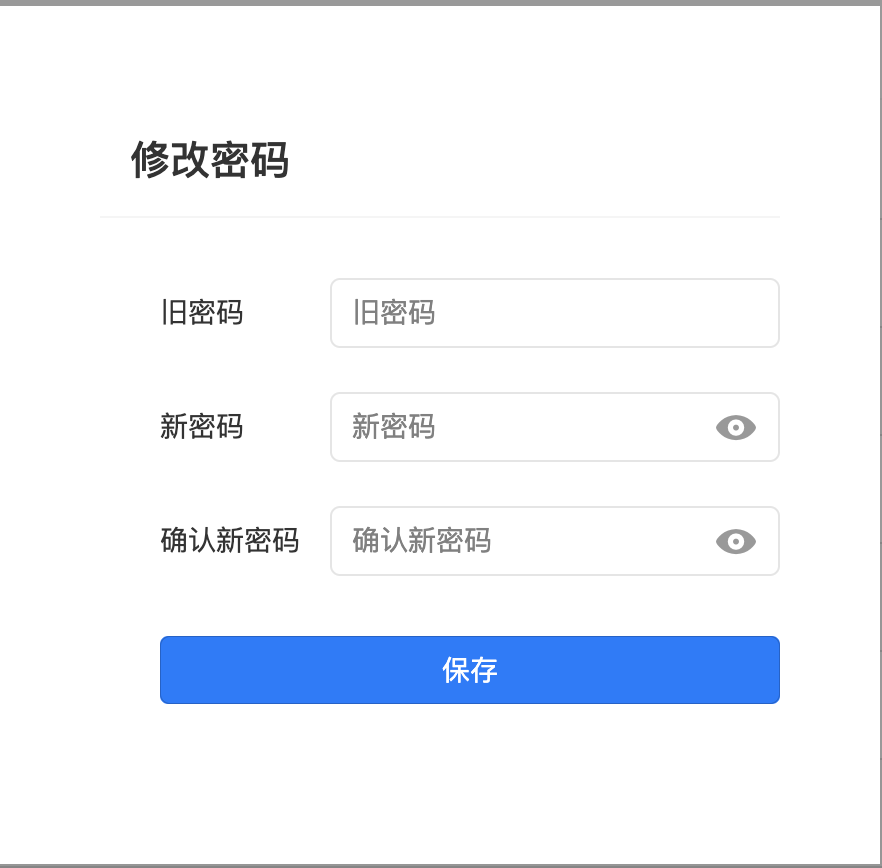

### 打包编译
- 在项目文件夹`freecloud-admin`上右键依次选择【发行】-【网站-H5手机版（仅适用于uni-app）】
  
- 点击【发行】按钮
  
- 控制台输出编译结果
  

### 上传部署  
- 在项目文件夹`freecloud-admin`上右键依次选择【发行】-【上传网站到服务器】
  
- 点击云服务空间列表中`freecloud-admin`后方的【开通托管】
    
- 在打开的浏览器网页中，确认开通
  
- 回到`HBuilderX`的上传界面
  - 去除【重新编译uni-app】的勾选
  - 点击【刷新列表】
  - 选中`freecloud-admin`后点击【上传】
    
- 控制台输出上传结果
  
- 点击控制台提供的访问地址
  - 初始超级管理员`admin`/`admin123`
  - 初始子站点管理员`test`/`test123`
  
- 登录成功后，点击右上方【修改密码】即可修改超级管理员密码
  
  
  !> 如需进行自定义域名等操作，可进入 [web控制台](https://unicloud.dcloud.net.cn/static/hosting?platform=aliyun&appid=) 操作
  
