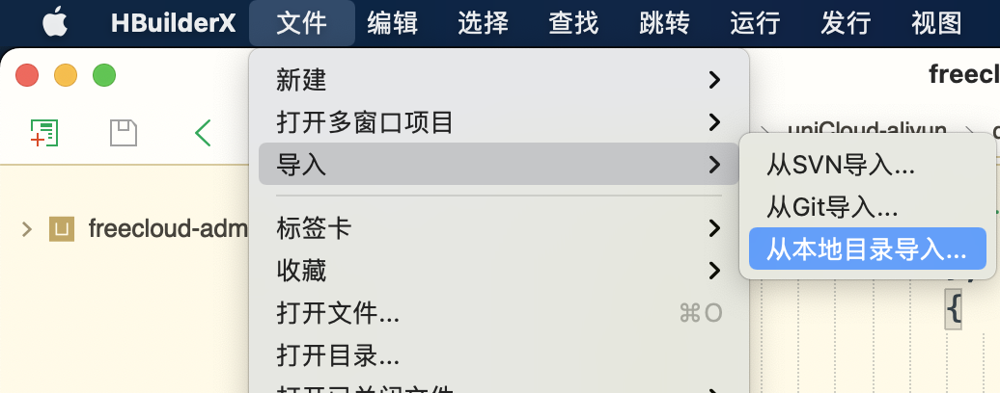
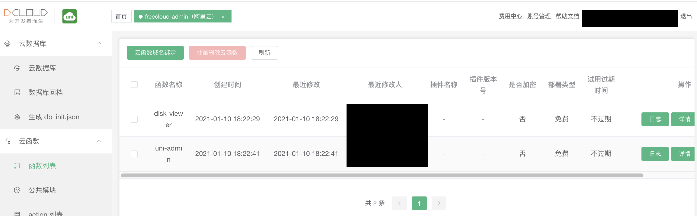
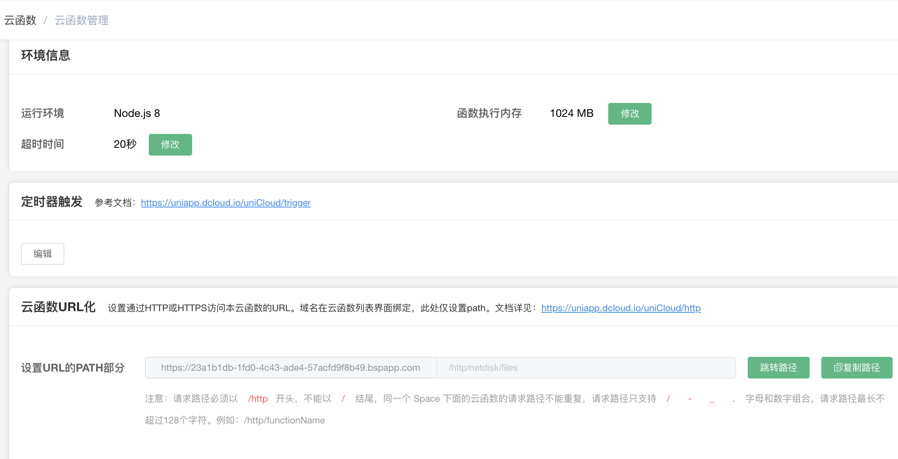
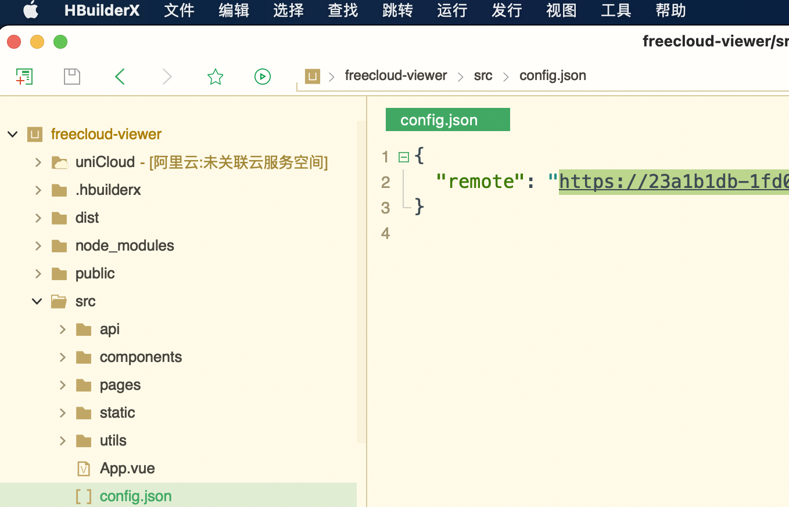
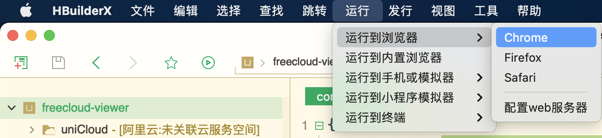
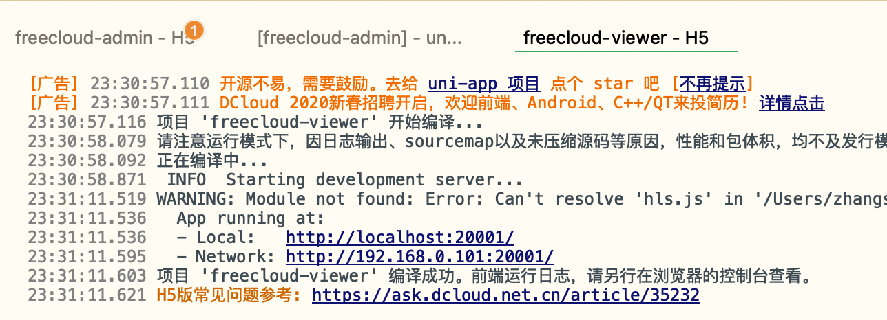
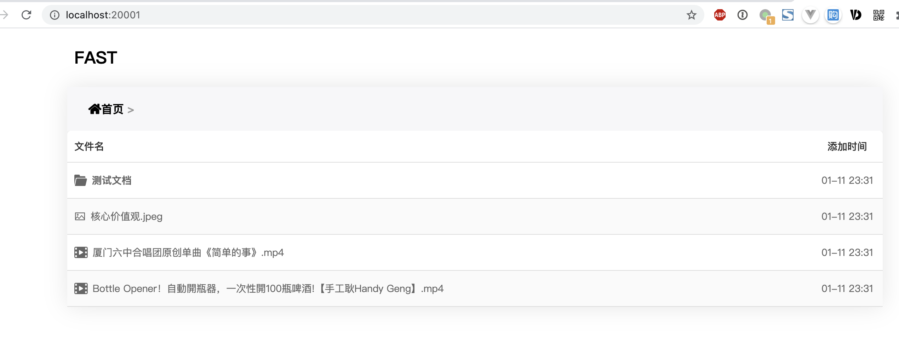

### 导入项目
- 检出代码
  ```bash
  git clone https://github.com/git9527/freecloud-viewer
  ```
- 进入项目文件夹并安装依赖
  ```bash
  cd freecloud-viewer
  npm install
  ```
- 打开`HbuilderX`并导入本地项目
  
  
### 配置项(非常重要)
- 打开 [web控制台](https://unicloud.dcloud.net.cn/cloud/function?platform=aliyun&appid=) 
- 选择进入`freecloud-admin`服务空间，依次点击【云函数】-【函数列表】
  
- 选择进入`disk-viewer`函数，点击页面最下方【云函数URL化】后的【复制路径】按钮
  
- 回到`HBuilderX`，打开`src`文件夹下`config.json`文件，调整远程Url，将其替换为刚复制的路径
  

### 本地运行
- 左键选中`freecloud-viewer`项目，从`HbuilderX`顶部工具栏选择【运行至浏览器】->【Chrome】(其他浏览器也行)
  
  - 控制台输出编译结果
  
- 打开的浏览器中会显示如下页面
  
  
