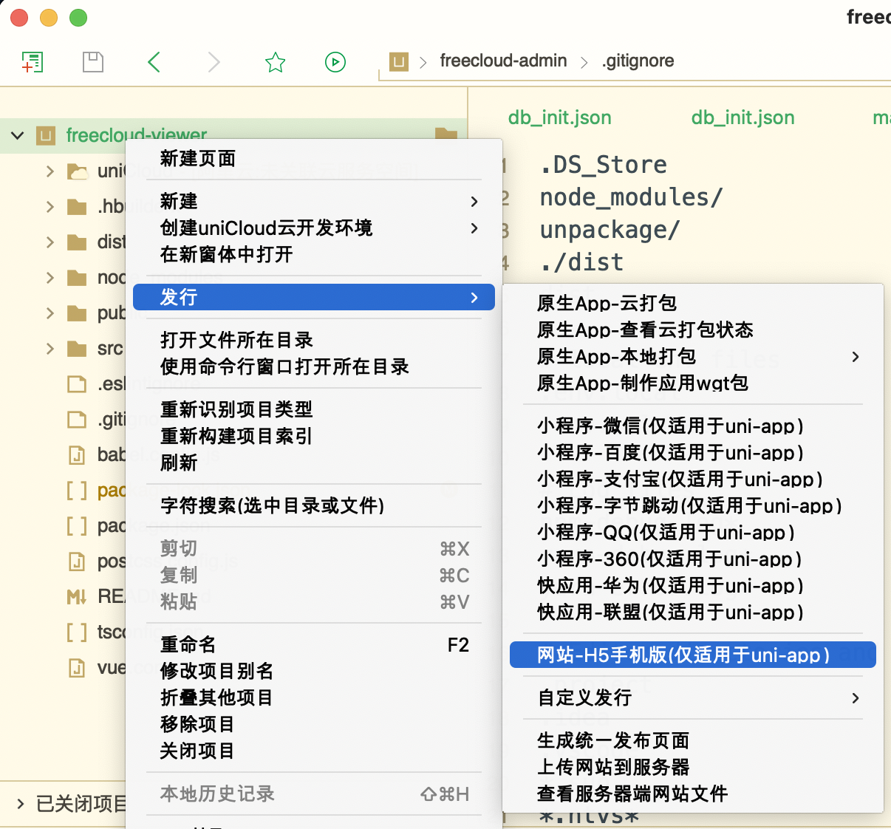
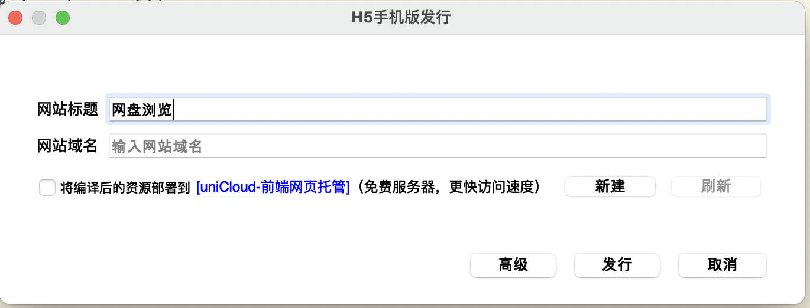
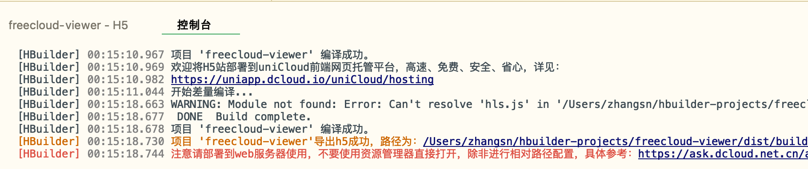
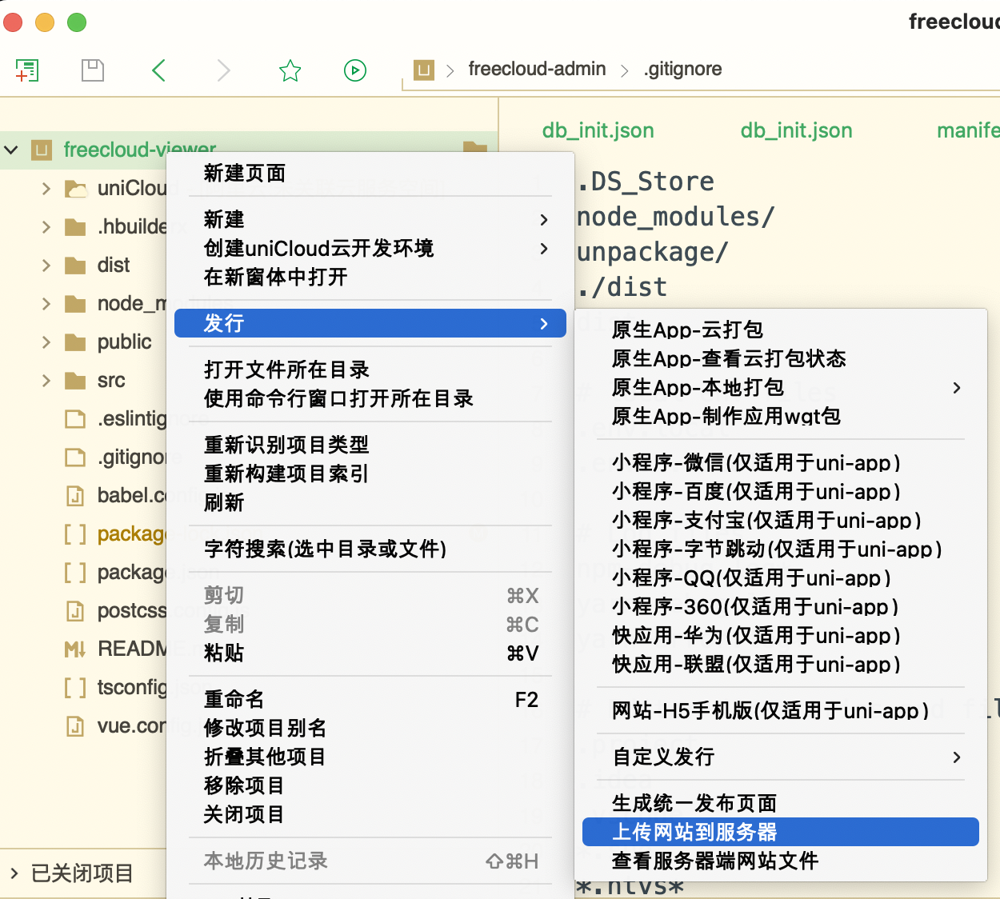
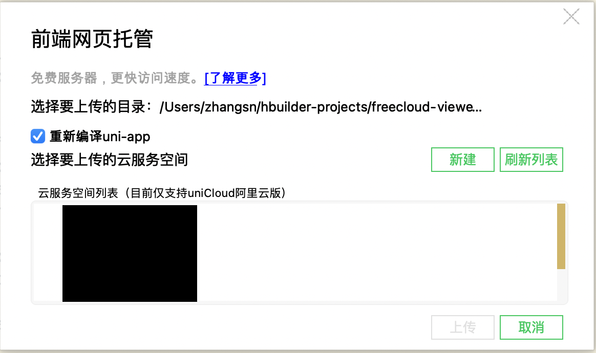
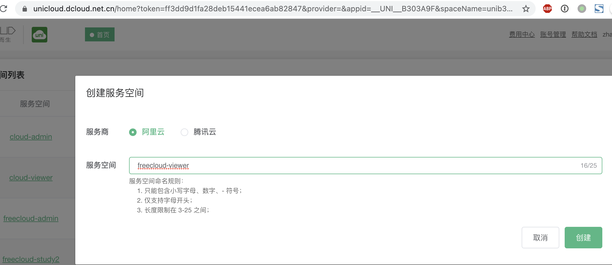
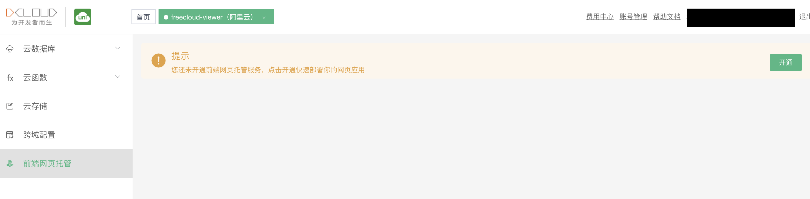
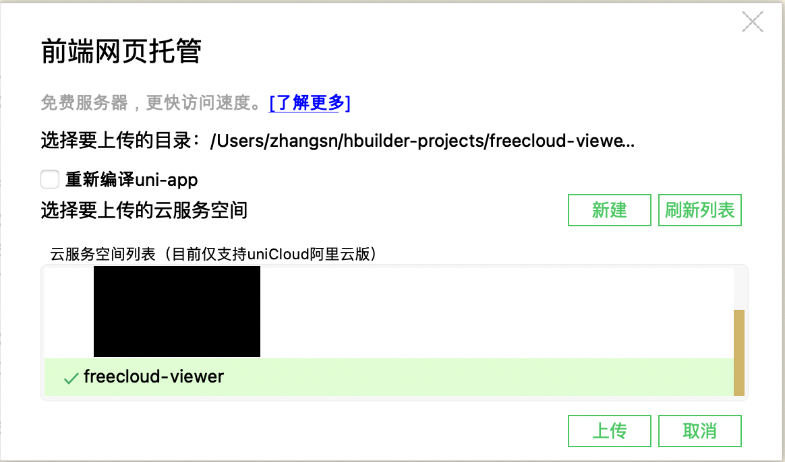
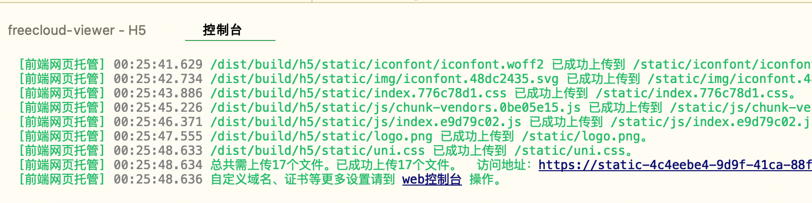

### 打包编译
- 在项目文件夹`freecloud-viewer`上右键依次选择【发行】-【网站-H5手机版（仅适用于uni-app）】
  
- 点击【发行】按钮
  
- 控制台输出编译结果
  

### 上传部署
- 在项目文件夹`freecloud-viewer`上右键依次选择【发行】-【上传网站到服务器】
  
- 在弹出框中点击【新建】
  
- 在打开的浏览器网页中，输入`freecloud-viewer`后确认创建
  
- 选择左侧菜单的【前端网页托管】，确认开通
  
- 回到`HBuilderX`的上传界面
    - 去除【重新编译uni-app】的勾选
    - 点击【刷新列表】
    - 选中`freecloud-viewer`后点击【上传】
      
- 控制台输出上传结果
  

  !> 如需进行自定义域名等操作，可进入 [web控制台](https://unicloud.dcloud.net.cn/static/hosting?platform=aliyun&appid=) 操作
  
